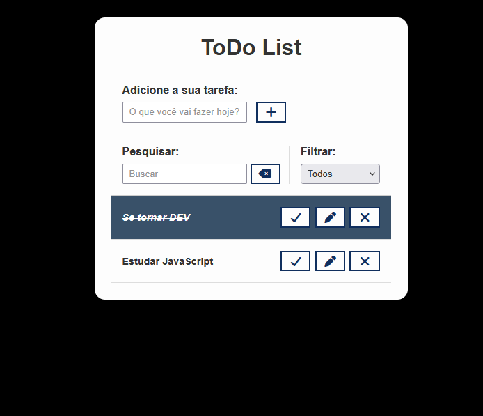

<h1 align="center"> ToDo List </h1>

 

  

## 🚀 Tecnologias

Esse projeto foi desenvolvido com as seguintes tecnologias:

- HTML e CSS
- JavaScript
- Git e Github

## 💻 Projeto

Um aplicativo simples de lista de tarefas feito com HTML, CSS e JavaScript, onde é possível adicionar, marcar como concluído e remover tarefas.
O objetivo do projeto é praticar manipulação do DOM e lógica de programação em JavaScript.

---